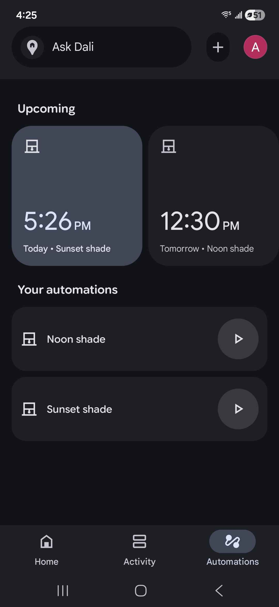

# matter_blind
This is firmware for matter compatible outdoor blind.  

Parts:
Aluminum downspout, or 2x3 stud   
Silver Tarp

Motor 68ktyz, recommend 10rpm.  
Micro switch cyt1073   
Esp32 Oled, Wemos Lolin   
Solid state relay 2 channel 5v   
5V700MA power supply 
